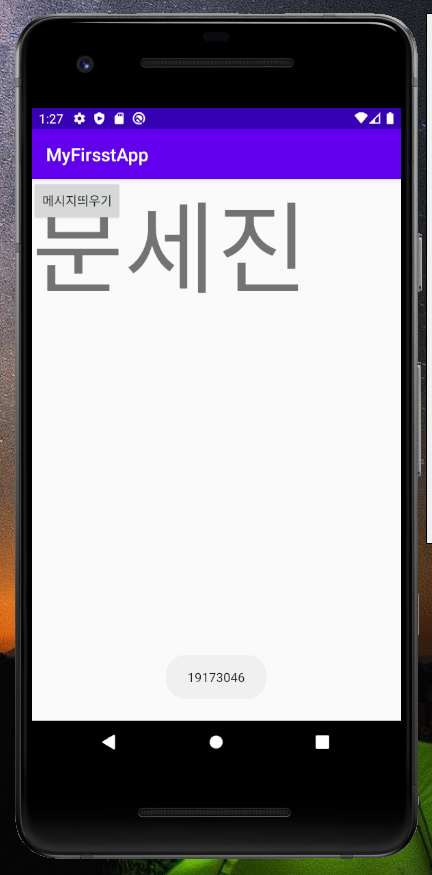
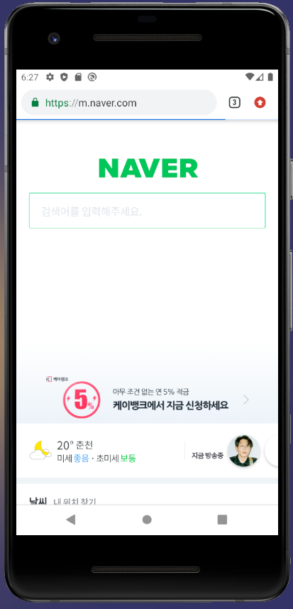
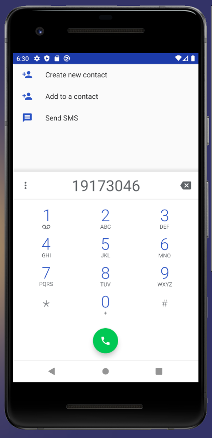
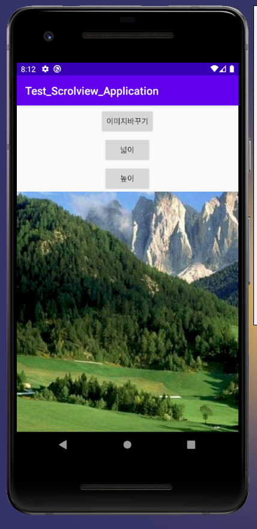

# Capstone-design-Task
it비즈니스과 b반 _19173046 문세진

과제 내는 곳

## 1주차 과제
!

## 2주차 과제
  </img>

## 3주차 과제
  </img>
  </img>
 
## 4주차 과제
아기들이나 어린친구들이 가지고 놀 수 있는 장난감/도구 혹은 디자이너들이 만든 수제장난감/도구를 판매하고 있는 앱.

모든 유아와 어린이들이 안전하고 재밌게 가지고 놀 수 있는 장난감과 어린이집, 유치원 등에서 사용될 환경판 혹은 날짜판 등 여러 가지의 구성판 교구들을 판매한다.

주 사용자인 어린이집, 유치원 교사 등이 사용할 수 있는 교구들을 판매하는 앱으로, 사용자가 앱에서 판매하는 상품도 구매할 수 있지만 남들과는 다르게 1:1 맞춤 제작하여 만드는 특별한 교구/장난감도 판매한다.

## 9주차 과제
</img>
